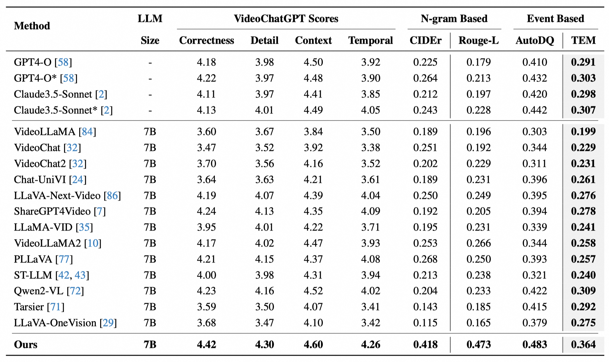

# Dynamic Facial Expression Caption Dataset (DFEC)

本仓库提供视频描述标注文件（`train.json` 整理中，`test.json` 已发布），旨在**增强多模态大模型对人物面部动态变化的细粒度理解能力**，适用于视频描述生成、跨模态检索等任务。

---

## 数据集内容

### 标注文件
- **`test.json`**（已发布）  
  - **测试集结构**：
    - **已有数据集采样**（800 条）：从 AFEW-VA、DFEW 等 7 个公开数据集中筛选的多样化样本。
    - **团队采集视频**（200 条，处理中）：新增真实场景视频，正在标注审核。
  - **字段说明**：
    ```json
    {
      "id": "样本唯一标识符",
      "video": "视频文件路径（对应原始数据集的相对路径）",
      "caption": "对人物面部动态的细粒度文本描述（英文）"
    }
    ```

- **`train.json`**（整理中）  
  - 计划发布 5000+ 条标注，覆盖更丰富的面部表情变化场景。

---

## 数据集意义
通过提供**精细的面部动作时序描述**（如眉毛微抬、嘴角紧绷），帮助模型建立视频帧序列与自然语言描述的细粒度关联，突破传统“情感标签”的粗粒度限制。

---

## 视频来源与版权声明

### 原始数据集
测试集中 800 条样本的视频来源如下（已验证描述准确性）：
1. **AFEW-VA**  
   - 描述：带情感效价（Valence-Arousal）连续值标注的视频片段  
   - 下载链接：[AFEW-VA Dataset](https://www.openu.ac.il/home/hassner/AFEW-VA/)（需邮件申请）

2. **CAER_mp4**  
   - 描述：基于上下文场景的情感识别视频数据集  
   - 下载链接：[CAER GitHub](https://github.com/ok1nagi/caer)（直接下载）

3. **DFEW**  
   - 描述：野外环境下动态面部表情视频数据集（7 种基础表情）  
   - 下载链接：[DFEW Dataset](https://dfew-dataset.github.io/)（CC BY-NC-SA 4.0 协议）

4. **FERV39k**  
   - 描述：包含 39 种精细表情类别的大规模视频数据集  
   - 下载链接：[FERV39k GitHub](https://github.com/Facial-Expression-Recognition/FERV)（需签署协议）

5. **MAFW**  
   - 描述：多属性（表情+年龄+性别）标注的野外视频数据集  
   - 下载链接：[MAFW Dataset](https://mafw-dataset.github.io/)（CC BY 4.0 协议）

6. **MER24**  
   - 描述：高帧率微表情视频数据集（24 种微表情类别）  
   - 下载链接：[MER24 Dataset](https://mer24-dataset.org/)（需机构邮箱申请）

7. **RAVDESS**  
   - 描述：多模态（视频+音频）情感表达数据集（8 种情感）  
   - 下载链接：[RAVDESS Download](https://zenodo.org/record/1188976)（CC BY-SA 4.0 协议）

### 版权声明
- ⚠️ **本仓库不包含原始视频文件**，仅提供标注信息。
- 用户需**自行下载原始数据集**并遵守其许可协议（通常限研究用途）。
- **团队采集视频**（200 条）计划于 2024 年 Q1 开放申请。

---

## 结果对比

以下是基于本数据集的基线模型性能对比（完整实验细节见技术报告）：



---

## 引用

如果本数据对您的研究有帮助，请引用我们的技术报告（筹备中）或使用如下格式致谢：
```bibtex
@misc{FEVCD2023,
  author       = {Your Team Name},
  title        = {Facial Expression Video-Caption Dataset},
  year         = {2023},
  publisher    = {GitHub},
  howpublished = {\url{https://github.com/your_username/your_repo}}
}
